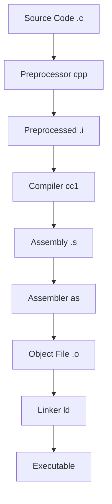

# Compilation Process

## Overview of Compilation Pipeline

<div align="center">



</div>

## Preprocessing Stage

The preprocessor handles directives that start with `#`.

### Example Program

```c
// main.c
#include <stdio.h>

#define MAX_SIZE 100
#define SQUARE(x) ((x) * (x))

#ifdef DEBUG
    #define DBG_PRINT(x) printf("Debug: %s\n", x)
#else
    #define DBG_PRINT(x)
#endif

int main() {
    int size = MAX_SIZE;
    int area = SQUARE(10);
    
    DBG_PRINT("Starting program");
    printf("Size: %d, Area: %d\n", size, area);
    
    return 0;
}
```

### Preprocessing Commands

```bash
# View preprocessed output
gcc -E main.c -o main.i

# Or directly to stdout
gcc -E main.c

# With debug symbols
gcc -E -DDEBUG main.c
```

### What the Preprocessor Does

1. **File Inclusion**: Replaces `#include` with file contents
2. **Macro Expansion**: Substitutes `#define` macros
3. **Conditional Compilation**: Processes `#ifdef`, `#ifndef`, `#if`
4. **Comment Removal**: Strips out comments
5. **Line Numbering**: Adds line directives for debugging

## Compilation to Assembly

The compiler translates preprocessed C into assembly language.

### Compilation Commands

```bash
# Compile to assembly
gcc -S main.c -o main.s
$ ls -l

# View with different optimization levels
gcc -S -O0 main.c -o main_O0.s    # No optimization
gcc -S -O1 main.c -o main_O1.s    # Basic optimization
gcc -S -O2 main.c -o main_O2.s    # More optimization
gcc -S -O3 main.c -o main_O3.s    # Aggressive optimization

# Generate assembly with debugging info
gcc -S -g main.c -o main_debug.s
```

### Example Assembly Output

```asm
# main.s (simplified x86_64)
.file	"main.c"
.text
.globl	main
.type	main, @function

main:
.LFB0:
	pushq	%rbp
	movq	%rsp, %rbp
	subq	$16, %rsp
	
	movl	$100, -4(%rbp)      # size = MAX_SIZE (100)
	movl	$100, -8(%rbp)      # area = SQUARE(10) = 100
	
	movl	-8(%rbp), %edx      # Load area
	movl	-4(%rbp), %esi      # Load size
	leaq	.LC0(%rip), %rdi    # Load format string
	movl	$0, %eax
	call	printf@PLT
	
	movl	$0, %eax            # return 0
	leave
	ret

.section .rodata
.LC0:
	.string	"Size: %d, Area: %d\n"
```

### Compiler Optimizations

Different optimization levels produce vastly different assembly:

```c
// test.c
int add_numbers(int a, int b) {
    int temp = a + b;
    return temp;
}

int main() {
    int result = add_numbers(5, 3);
    return result;
}
```

**-O0 (No optimization):**
```asm
add_numbers:
    pushq   %rbp
    movq    %rsp, %rbp
    movl    %edi, -20(%rbp)
    movl    %esi, -16(%rbp)
    movl    -20(%rbp), %edx
    movl    -16(%rbp), %eax
    addl    %edx, %eax
    movl    %eax, -4(%rbp)
    movl    -4(%rbp), %eax
    popq    %rbp
    ret
```

**-O2 (Optimized):**
```asm
add_numbers:
    leal    (%rdi,%rsi), %eax    # Just lea instruction!
    ret
```

## Assembly Stage

The assembler converts assembly language into machine code.

### Assembly Commands

```bash
# Assemble to object file
as main.s -o main.o

# Or using gcc
gcc -c main.s -o main.o

# View object file contents
objdump -d main.o       # Disassemble
objdump -t main.o       # Symbol table
objdump -h main.o       # Section headers
readelf -a main.o       # ELF file analysis
```

### Object File Structure

```bash
# Examine sections
$ objdump -h main.o

Sections:
Idx Name          Size      VMA               LMA               File off  Algn
  0 .text         00000035  0000000000000000  0000000000000000  00000040  2**0
  1 .data         00000000  0000000000000000  0000000000000000  00000075  2**0
  2 .bss          00000000  0000000000000000  0000000000000000  00000075  2**0
  3 .rodata       00000014  0000000000000000  0000000000000000  00000075  2**0
```

### Symbol Tables

```bash
# View symbols
$ objdump -t main.o

SYMBOL TABLE:
0000000000000000 l    df *ABS*  0000000000000000 main.c
0000000000000000 l    d  .text  0000000000000000 .text
0000000000000000 l    d  .rodata        0000000000000000 .rodata
0000000000000000 g     F .text  0000000000000035 main
0000000000000000         *UND*  0000000000000000 printf
```

## Linking Stage

The linker combines object files and libraries into a final executable.

### Types of Linking

#### Static Linking
```bash
# Static linking (includes library code in executable)
gcc -static main.o -o main_static

# Check size difference
ls -la main_static main_dynamic
```

#### Dynamic Linking
```bash
# Dynamic linking (default)
gcc main.o -o main_dynamic

# View dynamic dependencies
ldd main_dynamic
```

### Linking Process

1. **Symbol Resolution**: Match function calls to definitions
2. **Relocation**: Adjust addresses for final memory layout
3. **Section Merging**: Combine similar sections from different objects
4. **Entry Point Setting**: Set program start address

### Example Multi-File Project

**math.h:**
```c
#ifndef MATH_H
#define MATH_H

int add(int a, int b);
int multiply(int a, int b);

#endif
```

**math.c:**
```c
#include "math.h"

int add(int a, int b) {
    return a + b;
}

int multiply(int a, int b) {
    return a * b;
}
```

**main.c:**
```c
#include <stdio.h>
#include "math.h"

int main() {
    int sum = add(5, 3);
    int product = multiply(4, 7);
    
    printf("Sum: %d, Product: %d\n", sum, product);
    return 0;
}
```

**Compilation Process:**
```bash
# Compile each source file to object file
gcc -c math.c -o math.o
gcc -c main.c -o main.o

# Link object files
gcc math.o main.o -o program

# Or do it all in one step
gcc math.c main.c -o program
```

## Creating and Using Libraries

### Static Libraries (.a files)

```bash
# Create static library
ar rcs libmath.a math.o

# Link with static library
gcc main.o -L. -lmath -o program_static

# Or specify full path
gcc main.o libmath.a -o program_static
```

### Shared Libraries (.so files)

```bash
# Create shared library
gcc -shared -fPIC math.c -o libmath.so

# Link with shared library
gcc main.o -L. -lmath -o program_shared

# Run with shared library (if not in standard path)
LD_LIBRARY_PATH=. ./program_shared
```

## Build Systems

### Makefiles

```makefile
# Makefile
CC = gcc
CFLAGS = -Wall -Wextra -g
OBJECTS = main.o math.o
TARGET = program

$(TARGET): $(OBJECTS)
	$(CC) $(OBJECTS) -o $(TARGET)

main.o: main.c math.h
	$(CC) $(CFLAGS) -c main.c

math.o: math.c math.h
	$(CC) $(CFLAGS) -c math.c

clean:
	rm -f $(OBJECTS) $(TARGET)

.PHONY: clean
```

### CMake Example

```cmake
# CMakeLists.txt
cmake_minimum_required(VERSION 3.10)
project(MathProgram)

set(CMAKE_C_STANDARD 99)

add_library(math math.c)
add_executable(program main.c)
target_link_libraries(program math)
target_include_directories(program PRIVATE .)
```

## Debugging Information

### Debug Symbols

```bash
# Compile with debug information
gcc -g -O0 main.c -o main_debug

# Strip debug information
strip main_debug -o main_stripped

# Compare file sizes
ls -la main_debug main_stripped

# View debug sections
objdump -g main_debug    # Debug sections
readelf -w main_debug    # DWARF debug info
```

### Different Debug Formats

```bash
# DWARF format (default on Linux)
gcc -g -gdwarf-4 main.c -o main_dwarf

# Generate additional debug info
gcc -g3 main.c -o main_debug3    # Include macro definitions

# Split debug info
objcopy --only-keep-debug main_debug main.debug
objcopy --strip-debug main_debug
objcopy --add-gnu-debuglink=main.debug main_debug
```

## Cross-Compilation

### Targeting Different Architectures

```bash
# 32-bit on 64-bit system
gcc -m32 main.c -o main_32bit

# Different target architecture (requires cross-compiler)
arm-linux-gnueabihf-gcc main.c -o main_arm
```

## Common GCC Options

### Output Control

```bash
# Specify output file
gcc main.c -o program              # Custom executable name
gcc -c main.c -o main.o           # Object file output
gcc -S main.c -o main.s           # Assembly output
gcc -E main.c -o main.i           # Preprocessed output

# Multiple files
gcc file1.c file2.c -o program    # Compile and link multiple files
gcc *.c -o program                # Compile all C files in directory
```

### Preprocessing Options

```bash
# Define macros
gcc -DDEBUG main.c                # Define DEBUG macro
gcc -DMAX_SIZE=200 main.c         # Define macro with value
gcc -DDEBUG=1 -DVERSION=\"1.0\" main.c  # Multiple definitions

# Include directories
gcc -I/usr/local/include main.c   # Add include directory
gcc -I. -I../include main.c       # Multiple include paths

# Preprocessor only
gcc -E main.c                     # Show preprocessed output
gcc -M main.c                     # Generate dependency information
gcc -MM main.c                    # Dependencies without system headers
```

### Library and Linking Options

```bash
# Link with libraries
gcc main.c -lm                    # Link with math library
gcc main.c -lpthread             # Link with pthread library
gcc main.c -lssl -lcrypto         # Multiple libraries

# Library search paths
gcc main.c -L/usr/local/lib -lmylib   # Add library search directory
gcc main.c -L. -lmath                 # Use current directory

# Static vs dynamic linking
gcc main.c -static                # Force static linking
gcc main.c -shared                # Create shared library
gcc -fPIC -shared lib.c -o lib.so # Position Independent Code for shared lib

# Runtime library path
gcc main.c -Wl,-rpath,/opt/lib    # Set runtime library search path
```

### Debug and Profiling Options

```bash
# Debug information
gcc -g main.c                     # Include debug symbols
gcc -g3 main.c                    # Maximum debug info (includes macros)
gcc -ggdb main.c                  # GDB-specific debug format
gcc -gdwarf-4 main.c              # Specific DWARF version

# Profiling
gcc -pg main.c                    # Enable profiling with gprof
gcc -fprofile-arcs -ftest-coverage main.c  # Code coverage analysis
```

### Warning and Error Options

```bash
# Basic warnings
gcc -Wall main.c                  # Enable common warnings
gcc -Wextra main.c                # Extra warnings
gcc -Werror main.c                # Treat warnings as errors
gcc -w main.c                     # Suppress all warnings

# Specific warnings
gcc -Wunused main.c               # Warn about unused variables
gcc -Wformat main.c               # Check printf/scanf format strings
gcc -Wconversion main.c           # Warn about type conversions
gcc -Wshadow main.c               # Warn about variable shadowing
gcc -Wstrict-prototypes main.c    # Require function prototypes

# Error control
gcc -Wfatal-errors main.c         # Stop after first error
gcc -fmax-errors=5 main.c         # Limit number of errors reported
```

### Optimization Options

```bash
# Optimization levels
gcc -O0 main.c                    # No optimization (default)
gcc -O1 main.c                    # Basic optimization
gcc -O2 main.c                    # Standard optimization
gcc -O3 main.c                    # Aggressive optimization
gcc -Os main.c                    # Optimize for size
gcc -Ofast main.c                 # Fastest optimization (may break standards)

# Specific optimizations
gcc -O2 -funroll-loops main.c     # Unroll loops
gcc -O2 -finline-functions main.c # Inline functions aggressively
gcc -O2 -fomit-frame-pointer main.c # Omit frame pointer
gcc -O2 -ffast-math main.c        # Fast floating-point math
```

### Architecture and Platform Options

```bash
# Target architecture
gcc -m32 main.c                   # 32-bit target
gcc -m64 main.c                   # 64-bit target
gcc -march=native main.c          # Optimize for current CPU
gcc -march=core2 main.c           # Target specific CPU architecture
gcc -mtune=generic main.c         # Tune for generic CPU

# Platform-specific
gcc -msse4 main.c                 # Enable SSE4 instructions
gcc -mavx main.c                  # Enable AVX instructions
gcc -mfpmath=sse main.c           # Use SSE for floating-point math
```

### Security and Hardening Options

```bash
# Stack protection
gcc -fstack-protector main.c      # Basic stack protection
gcc -fstack-protector-all main.c  # Protect all functions
gcc -fstack-protector-strong main.c # Strong stack protection

# Position independence
gcc -fPIC main.c                  # Position Independent Code
gcc -fPIE main.c                  # Position Independent Executable
gcc -pie main.c                   # Create PIE executable

# Buffer overflow protection
gcc -D_FORTIFY_SOURCE=1 main.c    # Basic buffer overflow detection
gcc -D_FORTIFY_SOURCE=2 main.c    # Enhanced buffer overflow detection

# Other security features
gcc -Wl,-z,relro main.c           # Read-only relocations
gcc -Wl,-z,now main.c             # Immediate binding
gcc -Wl,-z,noexecstack main.c     # Non-executable stack
```

### Language Standard Options

```bash
# C standards
gcc -std=c89 main.c               # ANSI C (C89/C90)
gcc -std=c99 main.c               # C99 standard
gcc -std=c11 main.c               # C11 standard
gcc -std=c17 main.c               # C17 standard
gcc -std=gnu99 main.c             # GNU C99 (with extensions)

# Strict compliance
gcc -std=c99 -pedantic main.c     # Strict standard compliance
gcc -std=c99 -pedantic-errors main.c # Pedantic warnings as errors
```

### Debugging and Analysis Options

```bash
# Sanitizers (runtime error detection)
gcc -fsanitize=address main.c     # Address sanitizer (memory errors)
gcc -fsanitize=thread main.c      # Thread sanitizer (race conditions)
gcc -fsanitize=undefined main.c   # Undefined behavior sanitizer
gcc -fsanitize=leak main.c        # Memory leak detector

# Static analysis
gcc -fanalyzer main.c             # Enable static analyzer (GCC 10+)

# Verbose output
gcc -v main.c                     # Verbose compilation output
gcc -Q --help=target              # Show target-specific options
gcc -dumpspecs                    # Show built-in specs
```

### Miscellaneous Options

```bash
# Preprocessing control
gcc -C main.c                     # Keep comments in preprocessed output
gcc -P main.c                     # Don't generate line markers
gcc -traditional main.c           # Traditional C preprocessing

# Dependency generation
gcc -MD main.c                    # Generate dependency file
gcc -MMD main.c                   # Dependencies excluding system headers
gcc -MF deps.d main.c             # Specify dependency output file

# Temporary files
gcc -save-temps main.c            # Keep intermediate files
gcc -pipe main.c                  # Use pipes instead of temporary files

# Multiple jobs
make -j4                          # Use 4 parallel jobs (for makefiles)
gcc -j4 *.c                       # Parallel compilation (newer GCC versions)
```

### Practical Examples

**Development Build:**
```bash
gcc -g -O0 -Wall -Wextra -std=c99 -DDEBUG main.c -o main_debug
```

**Release Build:**
```bash
gcc -O2 -DNDEBUG -s main.c -o main_release
```

**Security-Hardened Build:**
```bash
gcc -O2 -D_FORTIFY_SOURCE=2 -fstack-protector-strong -fPIE -pie \
    -Wl,-z,relro,-z,now main.c -o main_secure
```

**Analysis Build:**
```bash
gcc -g -O1 -fsanitize=address -fsanitize=undefined -fanalyzer \
    -Wall -Wextra main.c -o main_analysis
```

## Key Takeaways

!!! important "Understanding Compilation"
    - **Preprocessing** expands macros and includes files
    - **Compilation** translates C to assembly language
    - **Assembly** converts assembly to machine code
    - **Linking** combines object files and resolves symbols
    - **Optimization** can dramatically change code structure

!!! tip "Reverse Engineering Insights"
    - Higher optimization makes code harder to reverse
    - Debug symbols provide valuable information
    - Static linking includes more code in the binary
    - Understanding compilation helps interpret disassembly

---

*Next: [Assembly Basics](03-assembly.md)*
